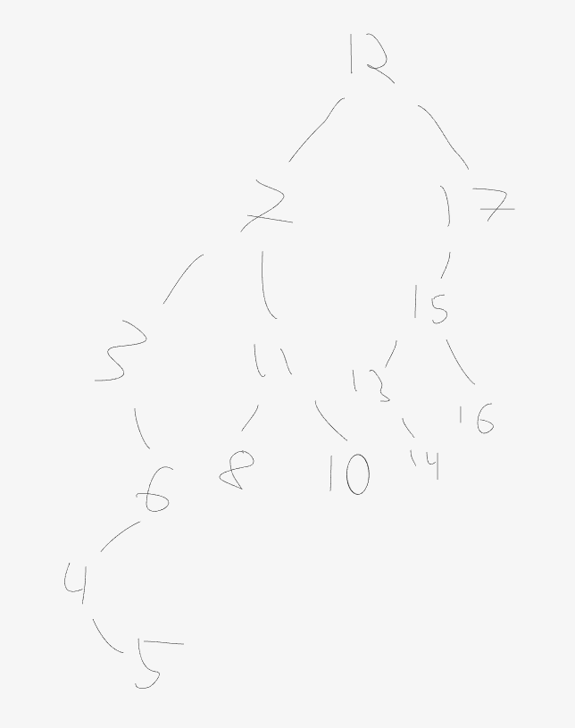

<h1 align="center">Eksamen 2017 19.12</h1>

## 1.

```java

    public static void frekvens(int[] a) {
        for (int i = 1; i < a.length; i++) {
            if (a[i] < a[i - 1])
                throw new IllegalArgumentException("Tabellen er ikke sortert stigende");
        }
        int n = 0;
        for (int i = 0; i < a.length; i++) {
            n++;
            if ((i < a.length - 1 &&  a[i] != a[i + 1]) ||  i == a.length - 1 ) {
                System.out.println(a[i] + " " + (n));
                n = 0;
            }
        }
    }

```

## 2.

```java
public static <T> T maks(Iterable<T> s, Comparator<? super T> c) {
        Iterator<T> it = s.iterator();
        if(!it.hasNext()) throw new NoSuchElementException("s er tom");
        T max = it.next();
        while (it.hasNext()) {
            T t = it.next();
            if(c.compare(t, max) > 0) max = t;
        }
        return max;
    }
```    


## 4.

<p align="center">
    
</p>