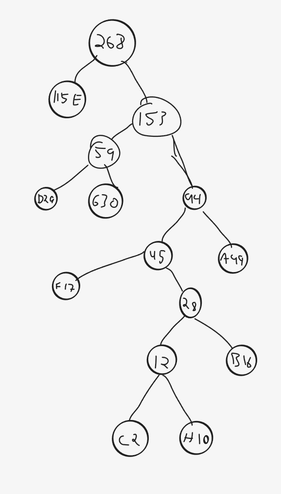

<h1 align="center">Eksamen 02.28.2018</h1>

## Oppgave 1

    Print: 1, 2, 6, 7, 8, 9

    ukjent() har hver sin peker på array a og b, og legger inn det minste fra
    hvert array. Om tallene er like, hoppes de over. Dvs. at ukjent
    fletter sammen to arrays sortert, og kun med unike tall. K som returneres er da
    indeks av det siste tallet som er lagt inn i C.
    Så printes det fra indeks 0 til k, altså alle tallene som er lagt inn i C.
    
## Oppgave 2

| A | B | C | D | E | F | G | H |
|---|---|---|---|---|---|---|---|
| 49 | 16 | 2 | 29 | 115 | 17 | 30 | 10 |


<p align="center">
    
</p>

| A | B | C | D | E | F | G | H |
|---|---|---|---|---|---|---|---|
| 111  | 11011  | 110100  | 100  | 0  | 1100  | 101  | 110101  |


### Da en litendel av sekvensen ble komprimert ved hjelp av disse bitkodene, ble resultatet: 1101011011100010011010011011111. 
### Hvilken delsekvens var det?
 
     HGFEDCBA

## Oppgave 3

```java
import java.util.Arrays;
import java.util.HashSet;
import java.util.stream.Collectors;

public class Mengde {
    private int[] a;

    public Mengde() // konstruktør
    {
        a = new int[0];
    }

    public Mengde(int[] b, int n) // konstruktør
    {
        for (int i = 1; i < n; i++) {
            if (b[i] < b[i - 1]) {
                throw new IllegalArgumentException("Tabellen er ikke sorter stigenede");
            }
            if (b[i] == b[i - 1]) {
                throw new IllegalArgumentException("Tabellen inneholder duplikat");
            }
        }

        a = new int[n];
        for(int i = 0; i < n; i++) {
            a[i] = b[i];
        }


    }

    public String toString() {
        return Arrays
                .stream(a)
                .mapToObj(Integer::toString)
                .collect(Collectors.joining(", "));
    }
} // class Mengde
```

## Oppgave 4

### a)

<p align="center">
    
</p>

### b)

<p align="center">
    
</p>

Høyde 0

### c)

<p align="center">
    
</p>

Høyde 1

### d)

<p align="center">
    
</p>

Høyde 2


## Oppgave 5

    

## Oppgave 6

### a)

| Espen | Bo | Ali | Petter | Karl | Siri | Muhammad | Mari | August | Åse |
|-------|----|-----|--------|------|------|----------|------|--------|-----|
| 8     | 7  | 4   | 5      | 2    | 7    | 4        | 3    | 5      | 3   |

### b)

<p align="center">
    
</p>


### c)

<p align="center">
    
</p>


### d)

    Det betyr hvor mange plasser i arrayet er tatt. Det er antall fulle plasser / antall plasser 
    totalt. Om denne stiger over 75%, så skal arrayets lengde økes med 75%.

### e)

    Det er ikke en god lengde, fordi med 10 så vil det oppstå mange kollisjoner, da flere tall 
    går opp i 10. Det er lurt å bruke primtall for å minimere mengden kollisjoner, da 
    færrest mulig tall går opp i et primtall.


