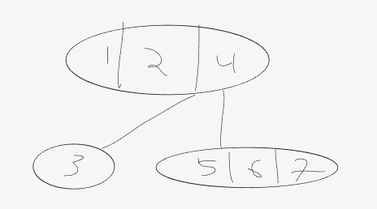

<h1 align="center">Eksamen høst 2019</h1>

# 1. Køer og stakker

### a. Beskriv kort hva de forskjellige følgende køene er:

    i. Kø er en FIFO (First in first out) kø. Element legges inn bakerst
        og taes ut forrest.
    ii. See above
    iii. LIFO (Last in First out). Element legges inn forrest, 
        og taes ut forrest.
    iiii. See above
    v. Er både LIFO OG FIFO.
    vi. Sorteres etter en gitt sammenligning. Ved for minste verdi først
        så ligger alltid den laveste verdi fremst i køen.

### b. Beskriv kort hva de forskjellige følgende køene er:

```java
public static void oppgave1(){
        /**
         * Del 1: Verdier vi skal legge inn
         * 
         *To char arrays opprettes av karakterene i de to strengene.
         * */
        char[]values_1="ALFABET".toCharArray();
        char[]values_2="FISK".toCharArray();
        
        /**
         * Del 2: Queue her
         * En FIFO-kø opprettes
         * Verdiene fra første array legges til
         * 1 verdi skrives ut og fjernes - A
         * De 4 neste verdiene skrives ut og fjernes - L, F, A, B 
         * Så legges verdiene fra array 2 til samme kø, - E, T, F, I, S, K
         * med de 2 verdiene som gjenst fra første array liggen fremst
         * Første element skrives ut og fjernes - E
         * Så skrives alle elementer ut, og fjernes - T, F, I, S, K
         * "ALFABETFISK"
         */
        Queue queue=new LinkedList<Character>();
        for(char value:values_1){
            queue.add(value);
        }
        System.out.print("Queue first: "+queue.remove());
        for(int i=0;i<4;++i){
            System.out.print(", "+queue.remove());
        }
        System.out.println();
        for(char value:values_2){
            queue.add(value);
        }
        System.out.print("Queue second: "+queue.remove());
        while(!queue.isEmpty()){
            System.out.print(", "+queue.remove());
        }
        System.out.println();
        /**
         * Del 3: Stack her
         * Stack opprettes og alle verdier fra første array legges inn
         * Første element skrives ut og fjernes - T
         * De fire neste skrives ut og fjernes - E, B, A, F
         * Verdier fra array 2 legges til - A, L, F, I, S, K
         * Første elemement skrives ut og fjernes - K
         * De fire neste skrives ut og fjernes - S, I, F, L, A
         * "TEBAFKSIFLA"
         * 
         */
        Stack stack=new Stack<Character>();
        for(char value:values_1){
            stack.push(value);
        }
        System.out.print("Stack first: "+stack.pop());
        for(int i=0;i<4;++i){
        System.out.print(", "+stack.pop());
        }
        System.out.println();
        for(char value:values_2){
        stack.push(value);
        }
        System.out.print("Stack second: "+stack.pop());
        while(!stack.isEmpty()){
        System.out.print(", "+stack.pop());
        }
        System.out.println();
        /**
         * Del 4: PriorityQueue her
         * Kø opprettes og alle verdier fra første array legges inn
         * Første element skrives ut og fjernes - A
         * De fire neste skrives ut og fjernes - A, B, E, F
         * Verdier fra array 2 legges til 
         * Første elemement skrives ut og fjernes - F
         * De fire neste skrives ut og fjernes - I, K, L, S, T
         * "AABEFFIKLST"
         */
        Queue pri_queue=new PriorityQueue();
        for(char value:values_1){
        pri_queue.add(value);
        }
        System.out.print("Priority queue first: "+pri_queue.remove());
        for(int i=0;i<4;++i){
        System.out.print(", "+pri_queue.remove());
        }
        System.out.println();
        for(char value:values_2){
        pri_queue.add(value);
        }
        System.out.print("Priority queue second: "+pri_queue.remove());
        while(!pri_queue.isEmpty()){
        System.out.print(", "+pri_queue.remove());
        }
        System.out.println();
        }
```

## 2. Quicksort

I denne oppgaven skal du sortere et sett med verdier med Quicksort. I denne oppgaven bruker vi arrayet
char[] values = {'B', 'C', 'K', 'A', 'F', 'L', 'T'};

## 3. Minimumsheap


# Se konte2020 for svar på oppgave 2 og 3

## 4. Dobbelt lenket liste

```java
public static class DoubleLinkedList {
    public class Node {
        Node next;
        Node prev;
        char value;
    }
    Node head;
    Node tail;
    void addLast(char value) {...}
    void addFirst(char value) {...}
    char removeLast() {...}
    char removeFirst() {...}
    void print() {...}
    void remove(int index) {
        if (index == 0) {
            removeFirst();
        }
        else if (index == size-1) {
            removeLast();
        }
        else {
            Node current;
            if(index < size / 2) {
                current = head;
                for(int i = 0; i < index; i++) {
                    current = current.next;
                }
            }
            else {
                current = tail;
                for(int i = size - 1; i > index; i--) {
                    current = current.prev;
                }
            }
            current.prev.next = current.next;
            current.next.prev = current.prev;
            current.next = null; 
            current.prev = null; //Hjelper JVM sin GC
            size--;
        }
    }
    void remove(char value) {
        Node current = head;
        while(current != null) {
            if(current.value == value) {
                if(current == head) {
                    removeFirst();
                }
                else if(current == tail) {
                    removeLast();
                }
                else {
                    current.prev.next = current.next;
                    current.next.prev = current.prev;
                    current.next = null;
                    current.prev = null; //Hjelper JVM sin GC
                    size--;
                }
                return;
            }
            current = current.next;
        }
    }
}

```

## 5. Binært søketre

### a. 
    
    Det er et binætre hvor venstre og høyre subtre til en node ikke avviker med 
    mer en 1 i høyde. 


### b.

<p align="center">
    
</p>

<p align="center">
    
</p>