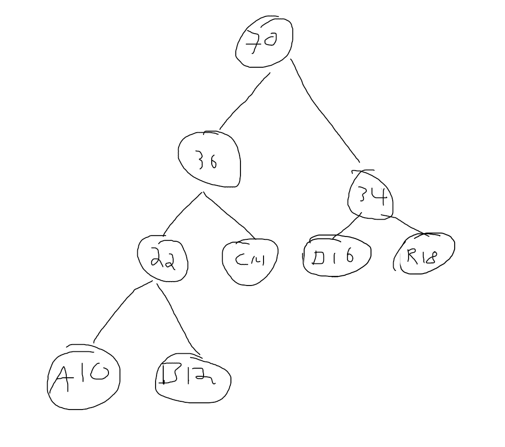
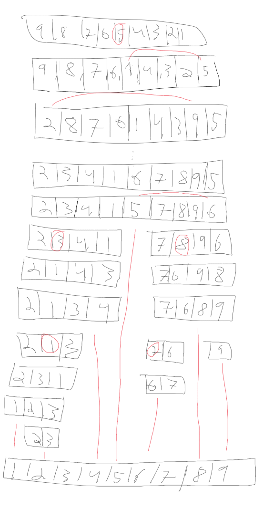

<h1 align="center">2019 Konte</h1>

#1. Iterasjon, rekursjon, og lenkede lister****

### a.

    Både iteratisjon og rekursjon utfører et sett med instruksjoner gjentatte ganger for det samme
    sluttresultat. Forskjellen ligger i prosessen.

    En iterativ funksjon løser et problem ved å iterativt gjenta et sett med instruksjoner til problemet
    er løst. Dette løses ofte ved bruk av løkker.
    
    En rekursiv funksjon løser et problem ved å dele opp problemet i mindre sub-problemer til vi 
    kommer til et trivielt basis tilfelle. Det fungerer ved at funksjonen kaller på seg selv.
    
### b.

```java
public void printIterative() {
    Node current = head;
    while(current != null) {
        System.out.println(current.value);
        current = current.next;
    }
}
```
    
### c.

```java
public void printRecursive() {
    printRecursive(head);
}

private void printRecursive(Node node) {
        if(node == null) return;
        System.out.println(node.value);
        printRecursive(node.next);
}

```

### d.

```java
public static void main(String[] args) {
     LinkedList liste = new LinkedList();
     char values[] = "ABCDEFGHIJ".toCharArray();
     for (char val : values) {
        liste.add(val);
     }
     System.out.println("Rekursiv utskrift: ");
     liste.printRecursive();
     System.out.println("Iterativ utskrift: ");
     liste.printIterative();
 }

```

    Utskrift blir følgende:
    JIHGFEDCBA
    JIHGFEDCBA
    
    Dette er fordi listen legger til verdiene fremst, slik første verdi (A) kommer bakerst osv.

#2. Huffmantrær

### a.
i.
<p align="center">
    
</p>

ii.

| A   | B   | C  | D  | R  |
|-----|-----|----|----|----|
| 000 | 001 | 01 | 10 | 11 |

### b.
i.
    
    00000111000

ii.

    11 bits

# 3. Sortering

### a.

<p align="center">
    
</p>

    Mergesort begynne ved å dele opp arrayet i to, også kalle seg selv rekursivt på de to halvdelene.
    Når alle elementene til slutt er delt opp i individuelle element i sub-arrays, så flettes de sammen.
    Når det kun er to individuelle elementer som flettes sammen, settes det minste først.
    Det gjør at når to sub-arrays med størrelse > 1 flettes sammen, er de sortert hver for seg.
    Da kan man flette de sammen ved å bruke samme metode, en peker på hver subarray, og flett det
    minste elementet inn først. Når alt er flettet sammen er arrayet sortert.

### b.

<p align="center">
    
</p>

    Quicksort bruker partisjonering for å sortere. Partisjonering er å velge en skilleverdi i et array, 
    og flytte alle verdier lavere enn skilleverdien til venstre, og høyere til høyre 
    (eller omvent om det skal sorteres synkende. 
    Deretter dele arrayet i to med skilleverdien som skillepunkt. 

    QuickSort partisjonerer rekursivt på partisjonene, slik at listen til slutt
    er delt opp i 2 verdier som da vil sorteres med den siste skilleverdi flyttingen.
    Når alle partisjonene slåes sammen igjen er da listen sortert.

### c.

    Verste tilfelle er hvor algoritmen må gjennomføre mest mulig operasjoner.
    Beste tilfeller er hvor algoritmen må gjennomføre færrest mulig operasjoner.

