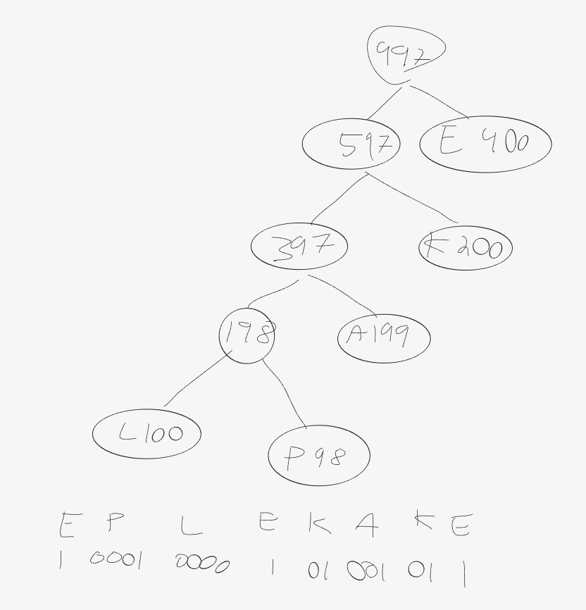
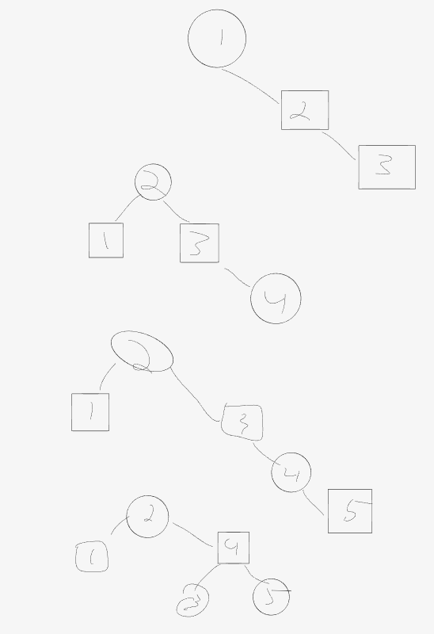

<h1 align="center">Eksamen 2020</h1>

### 1.

    O(n)

### 2.

    "Vanlig" kø

### 3.

    6! = 720

### 4.
    
    30 sek (kjøretid er O(n), derfor dobbles den)

### 5.

    2047

### 6.

    [3, 10]

### 7.

    log2(13) = 4

### 8.

    1 + 2 + 4 + 8 + 16 + 32 = 63
    Perfekt binærtre

### 9.
    
    [4, 3, 1, 5, 2]
    Siden det siste tallet er større en det nest siste, byttes de to
        
### 10.
    
    [2, 1, 3, 8, 7, 4, 6, 5]

### 11.

    B

### 12.

    1, 2, 3, 4, 5, 6, 7, 8, 9, 10, 11, 12

### 13.

    

    1000 1000 0101 0010 11

### 14.

    ADCBEFGH
    

### 15.

    

    C