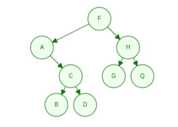
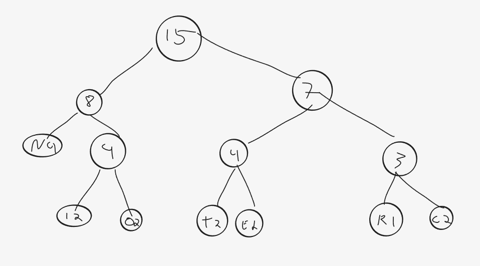

# Oppgave 1

## 1. Forklar hva en rekursiv funksjon er.

### 1. Hvilke til krav stiller vi så en rekursiv funksjon skal virke etter hensikten?

    Den må ha en base case, en sjekk i starten av funksjonen som gjør at 
    den har et sluttpunkt som avslutter løkken.
    Så må den også kalle på seg selv for å starte løkken.
   

### 2. Hva vil skje dersom disse kravene ikke fylles av funksjonen?
   
    Call-stacken vil overfylles av rekursjonskall, og vi vil få en stack overflow error.

## 2. Skriv ut verdien på nodene i treet i vedlegget ved å traversere det

### 1. Preorden
    
    F, A, C, B, D, H, G, Q

### 2. Inorden

    A, B, D, C, F, G, Q, H

### 3. Postorden

    B, D, C, A, G, Q, H, F

### 4. Nivå-orden

    F, A, H, C, G, Q, B, D

## 3. Hvordan regner man ut ID'en til hver node i binærtreet?

### 1. Skriv opp formelen for å regne ut ID til hver node.

    Hvis en node har posisjon k, og rotnoden er k = 1, er k sitt venstre barn 2k og høyre barn 2k + 1

### 2. Skriv opp ID'en til hver node.

    F = 1
    A = 2
    H = 3
    C = 5
    G = 6
    Q = 7
    B = 10
    D = 11

### 3. Hva brukes denne ID'en til?
    
    Den brukes til å kunne traverse treet i et array. Da kan man finne posisjon til barn og foreldre
    ved å bruke formlene (vb: 2k, hb: 2k + 1, f: k/2)

## 4. Forklar hvordan man traverserer treet

### 1. Preorden ved å bruke rekursjon eller iterasjon

    Rekursjon:
    I en rekursiv inOrder traversering sjekker man først for base case(node == null), 
    så utfører man oppgaven til noden, også kaller vi rekursivt på metoden med venstre barn
    så høyre barn. 

    Pseudo-kode:
    
    function inOrder(Node node) 
        if(node == null) return
        doTask(node)
        inOrder(node.left)
        inOrder(node.right)

### 2. Nivå-orden ved å bruke rekursjon eller iterasjon

    Iterasjon:
    Bruker en FIFO kø for å kunne legge nodene inn i riktig rekkefølge.
    
    function levelOrder(Node root)
        Queue<Node> queue
        add root to queue
        while queue is not empty do
            node = queue.poll
            doTask(node)
            if node.left is not null
                add node.left to queue
            if node.right is not null
                add node.right to queue

#Oppgave 2 Huffmantrær
    I denne oppgaven skal du bruke et Huffmantre til å kode ordet «INTERCONNECTION».

## 1. Lag Huffmantreet basert på ordet.
    
### 1. Lag en tabell med frekvenser til hver bokstav,
| I | N | T | E | R | C | O |
|---|---|---|---|---|---|---|
| 2 | 4 | 2 | 2 | 1 | 2 | 2 |

### 2. Lag en tegning av Huffmantreet

### 3. Og skriv opp Huffmankoden for hver bokstav

| I | N | T | E | R | C | O |
|---|---|---|---|---|---|---|
| 010 | 00 | 100 | 101 | 001 | 111 | 011 |

## 2. Bruk så Huffmankodene til å komprimere ordet.

### 1. Skriv opp den kodede binære meldingen.
    
    01000100101001111011000010111110001001100

### 2. Hvor mange bit bruker den opprinnelige (ukodede) meldingen?

    15*8 = 120 bits

### 3. Hvor mange bit bruker du i den kodede meldingen?
    
    41 bits

#3. QuickSort

    I denne oppgaven skal du sortere et sett med verdier med Quicksort. 
    I denne oppgavenbruker vi arrayetchar[] values = {'B', 'K', 'C', 'A', 'L', 'F', 'T', 'Q'};

## 1. Forklar hvordan QuickSort fungerer

### 1. Forklar hva partisjonering er.

    Partisjonering er å velge en skilleverdi i et array, og flytte alle verdier lavere enn
    skilleverdien til venstre, og høyere til høyre (eller omvent om det skal sorteres synkende. 
    Deretter dele arrayet i to med skilleverdien som skillepunkt. 

### 2. Forklar hvordan Quicksort bruker partisjonering til å sortere.

    QuickSort partisjonerer rekursivt på partisjonene, slik at listen til slutt
    er delt opp i 1-2 verdier som da vil sorteres med den siste skilleverdi flyttingen.
    Når alle partisjonene slåes sammen igjen er da listen sortert.

### 3. Lag en tegning som stegvis viser hvordan quicksort sorterer arrayet over. Når duskal partisjonere skal du bruke den midterste verdien. 

    B, K, C, A, L, F, T, Q
    Velger L som skilleverdi
    B, K, C, A, F, T, Q, L
    B, K, C, A, F    T, Q
    SV : C           SV: Q
    B, A  K, F       T
    SV:A  SV: F
       B     K         T, Q
    A, B,    F, K        T, Q
    A, B, C, F, K        T, Q
    A, B, C, D, F, K, L, T, Q

    