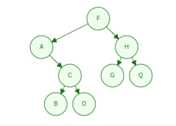
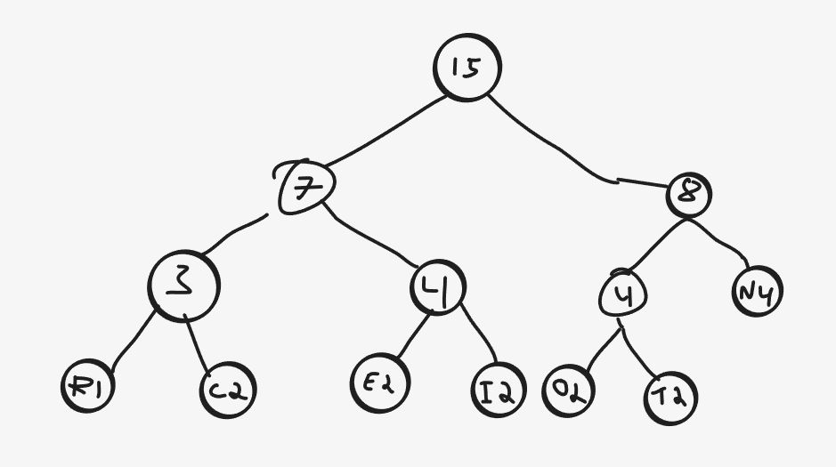
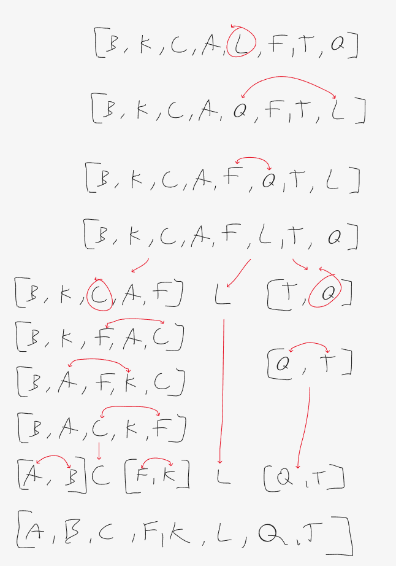
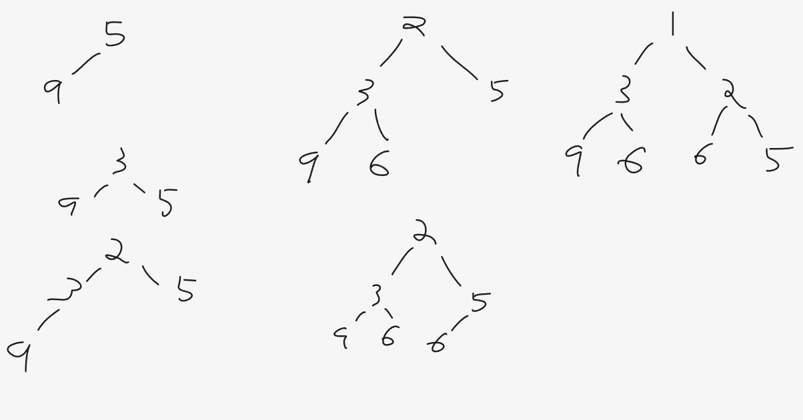
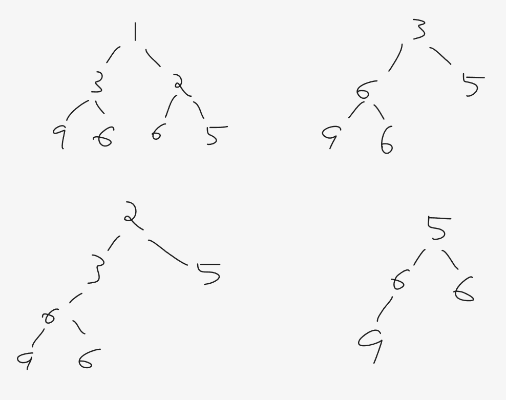

# Oppgave 1

<p align="center">
    
</p>

## 1. Forklar hva en rekursiv funksjon er.


### 1. Hvilke til krav stiller vi så en rekursiv funksjon skal virke etter hensikten?

    Den må ha en base case, en sjekk i starten av funksjonen som gjør at 
    den har et sluttpunkt som avslutter løkken.
    Så må den også kalle på seg selv for å starte løkken.
   

### 2. Hva vil skje dersom disse kravene ikke fylles av funksjonen?
   
    Call-stacken vil overfylles av rekursjonskall, og vi vil få en stack overflow error.

## 2. Skriv ut verdien på nodene i treet i vedlegget ved å traversere det

### 1. Preorden
    
    F, A, C, B, D, H, G, Q

### 2. Inorden

    A, B, D, C, F, G, H, Q

### 3. Postorden

    B, D, C, A, G, Q, H, F

### 4. Nivå-orden

    F, A, H, C, G, Q, B, D


## 3. Hvordan regner man ut ID'en til hver node i binærtreet?

### 1. Skriv opp formelen for å regne ut ID til hver node.

    Hvis en node har posisjon k, og rotnoden er k = 1, er k sitt venstre barn 2k og høyre barn 2k + 1

### 2. Skriv opp ID'en til hver node.

    F = 1
    A = 2
    H = 3
    C = 5
    G = 6
    Q = 7
    B = 10
    D = 11

### 3. Hva brukes denne ID'en til?
    
    Den brukes til å kunne traverse treet i et array. Da kan man finne posisjon til barn og foreldre
    ved å bruke formlene (vb: 2k, hb: 2k + 1, f: k/2)

## 4. Forklar hvordan man traverserer treet

### 1. Preorden ved å bruke rekursjon eller iterasjon

    Rekursjon:
    I en rekursiv inOrder traversering sjekker man først for base case(node == null), 
    så utfører man oppgaven til noden, også kaller vi rekursivt på metoden med venstre barn
    så høyre barn. 

    Pseudo-kode:
    
    function inOrder(Node node) 
        if(node == null) return
        doTask(node)
        inOrder(node.left)
        inOrder(node.right)

### 2. Nivå-orden ved å bruke rekursjon eller iterasjon

    Iterasjon:
    Bruker en FIFO kø for å kunne legge nodene inn i riktig rekkefølge.
    
    function levelOrder(Node root)
        Queue<Node> queue
        add root to queue
        while queue is not empty do
            node = queue.poll
            doTask(node)
            if node.left is not null
                add node.left to queue
            if node.right is not null
                add node.right to queue


#Oppgave 2 Huffmantrær
    I denne oppgaven skal du bruke et Huffmantre til å kode ordet «INTERCONNECTION».

## 1. Lag Huffmantreet basert på ordet.
    
### 1. Lag en tabell med frekvenser til hver bokstav,
| I | N | T | E | R | C | O |
|---|---|---|---|---|---|---|
| 2 | 4 | 2 | 2 | 1 | 2 | 2 |

### 2. Lag en tegning av Huffmantreet
<p align="center">
    
</p>

### 3. Og skriv opp Huffmankoden for hver bokstav

| I | N | T | E | R | C | O |
|---|---|---|---|---|---|---|
| 011 | 11 | 101 | 010 | 000 | 001 | 100 |

## 2. Bruk så Huffmankodene til å komprimere ordet.

### 1. Skriv opp den kodede binære meldingen.
    
    0111110101000000110011110100110101110011

### 2. Hvor mange bit bruker den opprinnelige (ukodede) meldingen?

    15*8 = 120 bits

### 3. Hvor mange bit bruker du i den kodede meldingen?
    
    41 bits

# 3. QuickSort

    I denne oppgaven skal du sortere et sett med verdier med Quicksort. 
    I denne oppgavenbruker vi arrayetchar[] values = {'B', 'K', 'C', 'A', 'L', 'F', 'T', 'Q'};

## 1. Forklar hvordan QuickSort fungerer

### 1. Forklar hva partisjonering er.

    Partisjonering er å velge en skilleverdi i et array, og flytte alle verdier lavere enn
    skilleverdien til venstre, og høyere til høyre (eller omvent om det skal sorteres synkende. 
    Deretter dele arrayet i to med skilleverdien som skillepunkt. 

### 2. Forklar hvordan Quicksort bruker partisjonering til å sortere.

    QuickSort partisjonerer rekursivt på partisjonene, slik at listen til slutt
    er delt opp i 1-2 verdier som da vil sorteres med den siste skilleverdi flyttingen.
    Når alle partisjonene slåes sammen igjen er da listen sortert.

### 3. Lag en tegning som stegvis viser hvordan quicksort sorterer arrayet over. Når duskal partisjonere skal du bruke den midterste verdien. 

<p align="center">
    
</p>

## 2. Algoritmeanalyse av quicksort

### 1. Forklar hva beste, gjennomsnittlig og verste tilfelle betyr når man snakker omkompleksiteten til en algoritme.

    Beste tilfelle er hvor algoritmen er så effektiv som mulig. For eksempel for bubble sort, om kun de to siste tallene
    er usortert, så går man bare gjennom listen en gang, og gjør en swap. Da er den O(n).
    Ved å kjøre algoritmen på en stor mengde varierende lister, med forskjellige innhold og størrelse, og tar 
    gjennomsnittet av dette, så finner vi den gjennomsnittlige kompleksiteten.
    Verste tilfelle er hvor algoritmen må gjøre sine heuristikker flest mulig ganger før listen er sortert.
    Som i bubble sort, om listen er omvendt sortert, så må algoritmen gå over alle tall for å flytte de til "topp".

### 2. Forklar hvorfor Quicksort i gjennomsnittstilfellet har kompleksiteten O(n log(n) )og i  verste tilfellet har kompleksiteten O(n2)

    Quicksort vil gjennomsnittlig dele hver partisjon i to i ca. like stor lengde, også kjøre algoritmen rekursivt på partisjonene,
    så vil antall ganger arrayet må deles være tallets base-2 logaritme. Så da vil vi ha log(n) partisjonsnivå,
    og får hvert nivå må gå gjennom N mengde input. Derfor O(n log n)

    I verste tilfelle velges det minste eller høyeste tallet som pivot for hvert nivå, og partisjonen vil deles opp
    i pivot, og resten i partisjon i størrelse n-1. Om dette skjer for hver eneste partisjon, vil vi ha N partisjoner
    for N nivåer, og derfor blir det log(N*N) -> log(N^2)


# 4. Dobbelt lenket liste

## 1.  Lag en tegning som viser hvordan du fjerner en node fra en dobbelt lenket liste ogbeskriv med ord hvordan du går frem
//TODO

## 2. Kopier funksjonen void remove(int index), og skriv innholdet i funksjonen der det ermarkert. Funksjonen skal fjerne noden på plass index.

```java    
    void remove(int index) {
        if (index == 0) {
            removeFirst();
        } else if (index == size - 1) {
            removeLast();
        } else {
            if(index < size / 2) {
                Node current = head;
                for(int i = 0; i < index; i++) {
                    current = current.next;
                }
            }
            else {
                Node current = tail;
                for(int i = size -1; i > index; i--) {
                    current = current.prev;
                }
            }
            
            current.prev.next = current.next;
            current.next.prev = current.prev;
            current.next = null;
            current.prev = null;
            size--;
        }
    }
```

## 3. Kopier funksjonen void remove(char value), og skriv innholdet i funksjonen der det ermarkert. Funksjonen skal fjerne den første noden som har verdi «value».

```java
    void remove(char value) {
        Node current = head;
        while(current != null) {
            if(current.value == value) {
                if(current == head) {
                    removeFirst();
                }
                else if(current == tail) {
                    removeLast();
                }
                else {
                    current.prev.next = current.next;
                    current.next.prev = current.prev;
                    current.next = null;
                    current.prev = null; //Hjelper JVM sin GC
                    size--;
                }
                return;
            }
            current = current.next;
        }
    }
```

# 5. Minimumsheap

### 1. Hva er en minimumsheap, og hvilke krav stilles for at det skal kunne kalles enminimumsheap?

    Et minimumsheap er en datastruktur som er bygd opp som et binærtre. Det krever at det er 
    et komplett minimums tre, hvor hver indre node har en verdi mindre eller lik dens barnenoder.

### 2. Start med en tom minimumsheap. Legg tallene 5, 9, 3, 2, 6, 6, 1 og tegn heapen forhvert tall du legger inn.

<p align="center">
    
</p>

### 3. Vi skal nå ta ut tre tall fra heapen. Ta ut ett og ett tall og tegn heapen for hvert tall dutar ut.

<p align="center">
    
</p>

### 4. Forklar hvordan en minimumsheap kan brukes til sortering uten å bruke ekstralagringsplass.
    
    En kan bruke node-id'ene til å lagre de i et array, også flytte på posisjonene internt.
    